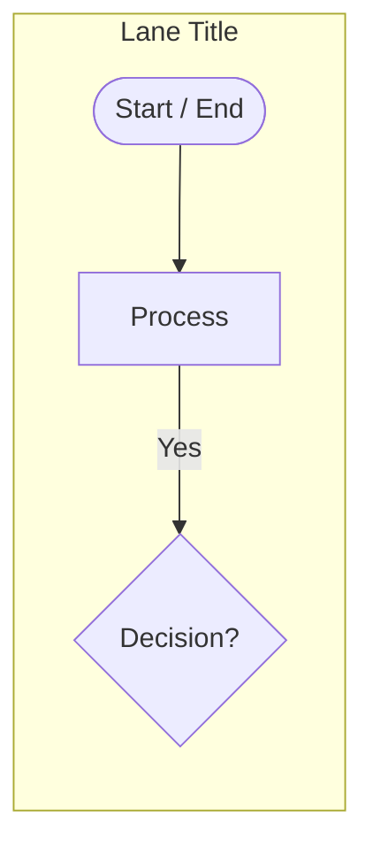
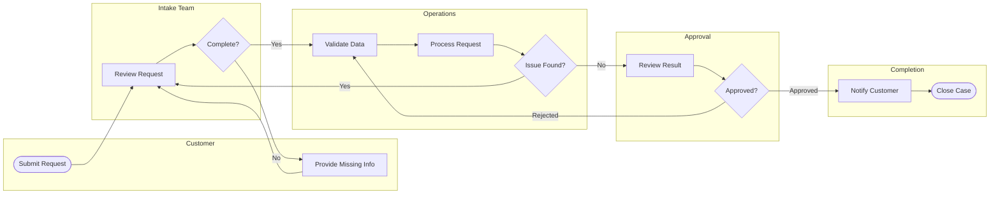

# AI Guide: Generate Swimlane Diagrams for Varagraph

Panduan ini untuk AI/agent yang ingin menghasilkan diagram swimlane yang langsung kompatibel dengan aplikasi Varagraph. Output utama yang paling aman adalah **Mermaid subset** karena bisa ditempel ke halaman **Import (Mermaid)** dan akan otomatis di-layout oleh canvas.

## Goal

AI harus menghasilkan diagram yang:

- valid untuk parser Varagraph,
- punya lane yang jelas,
- mengikuti arah flow kiri-ke-kanan antar lane dan atas-ke-bawah di dalam lane,
- memakai decision/branch seperlunya,
- label ringkas agar node tetap rapi,
- connector mengikuti level/arrow setelah Auto layout.

## Format wajib

Varagraph saat ini mendukung subset Mermaid berikut:



Aturan keras:

1. Baris pertama harus persis:
   ```mermaid
   flowchart LR
   ```
2. Gunakan `subgraph <LaneId>[<Lane Title>]` untuk lane.
3. Semua node harus dideklarasikan di dalam subgraph.
4. Semua edge harus mengarah ke node yang sudah ada.
5. ID node/lane harus diawali huruf dan hanya pakai huruf, angka, underscore, atau dash.
6. Jangan pakai syntax Mermaid lain seperti `classDef`, `style`, nested subgraph, markdown labels, HTML labels, `flowchart TD`, atau sequence diagram.

## Bentuk node yang didukung

| Bentuk | Syntax | Kapan dipakai |
| --- | --- | --- |
| Start / End | `A1([Begin process])` | Awal atau akhir flow |
| Process | `A2[Prepare request]` | Aktivitas/task biasa |
| Decision | `A3{Approved?}` | Pertanyaan bercabang Yes/No |

Catatan:
- Varagraph belum membedakan input/output dari Mermaid import; gunakan process biasa untuk data/input/output jika lewat Mermaid.
- Label decision harus berupa pertanyaan singkat.

## Bentuk edge yang didukung

| Edge | Syntax | Kapan dipakai |
| --- | --- | --- |
| Forward arrow | `A1 --> A2` | Flow normal |
| Labeled forward arrow | `A2 -- Approved --> B1` | Branch/condition |
| No arrow line | `A1 --- A2` | Relasi non-directional |
| Labeled no arrow line | `A1 -- Related --- A2` | Relasi berlabel tanpa arah |
| Both directions | `A1 <--> A2` | Sinkronisasi dua arah |
| Labeled both directions | `A1 <-- Sync --> A2` | Sinkronisasi berlabel |

Rekomendasi: untuk process flow, hampir selalu gunakan `-->` dan label hanya untuk branch (`Yes`, `No`, `Approved`, `Rejected`, `Retry`).

## Prinsip layout untuk hasil rapi

### 1. Urutkan lane dari kiri ke kanan berdasarkan peran/proses

Contoh urutan yang baik:

1. Requester / Customer
2. Intake / Front Office
3. Processing / Operations
4. Review / Approval
5. Completion / Archive

Jangan membuat lane berdasarkan status yang terlalu kecil jika lebih cocok menjadi node.

### 2. Deklarasikan node sesuai urutan flow

Di dalam setiap lane, tulis node dari flow paling awal ke paling akhir. Auto layout memakai urutan dan edge untuk menentukan level.

Baik:

```mermaid
subgraph OPS[Operations]
  OPS1[Receive request]
  OPS2[Validate data]
  OPS3{Data complete?}
  OPS4[Process request]
end
```

Kurang baik:

```mermaid
subgraph OPS[Operations]
  OPS4[Process request]
  OPS1[Receive request]
  OPS3{Data complete?}
  OPS2[Validate data]
end
```

### 3. Jaga flow utama tetap sederhana

Gunakan satu “happy path” utama, lalu tambahkan branch error/retry seperlunya.

Baik:

```mermaid
A1 --> B1
B1 --> C1
C1 --> C2
C2 -- Yes --> D1
C2 -- No --> B2
```

Hindari terlalu banyak edge silang yang membuat connector padat.

### 4. Decision harus punya label branch

Setiap edge keluar dari decision sebaiknya punya label singkat.

```mermaid
C2{Valid?}
C2 -- Yes --> C3
C2 -- No --> B2
```

### 5. Hindari cycle besar kecuali retry memang diperlukan

Cycle/retry boleh, tapi buat pendek dan jelas.

```mermaid
D2{Retry?}
D2 -- Yes --> C1
D2 -- No --> E1
```

Kalau cycle terlalu banyak, Auto layout bisa sulit mempertahankan level yang mudah dibaca.

## Label style

Gunakan label pendek agar node tidak terlalu tinggi:

- Ideal: 2–4 kata.
- Maksimum praktis: 5–7 kata.
- Hindari kalimat panjang.
- Gunakan Title Case atau sentence case secara konsisten.

Contoh baik:

```mermaid
A1([Submit Request])
B1[Check Completeness]
C1{Approved?}
D1[Send Notification]
```

Contoh kurang baik:

```mermaid
A1([The user submits a request through the online form with all required information])
```

## Template prompt untuk AI generator

Gunakan prompt seperti ini ketika meminta AI membuat diagram:

```text
Generate a Varagraph-compatible swimlane Mermaid diagram.
Return only Mermaid code.
Rules:
- First line must be exactly: flowchart LR
- Use subgraph lanes only, no nested subgraphs.
- Declare every node inside a lane before edges.
- Supported node shapes only: ([Start/End]), [Process], {Decision?}.
- Supported edges only: -->, -- label -->, -- label ---, ---, <-->.
- Use short labels, 2–5 words where possible.
- Use lane IDs and node IDs that start with a letter.
- Make the main flow left-to-right across lanes and top-to-bottom inside each lane.
- Add Yes/No labels to decision branches.
- Avoid unsupported Mermaid styling, classDef, HTML, markdown, or flowchart TD.
Topic: <describe process here>
Lanes: <optional lane list>
```

## Output checklist sebelum diberikan ke Varagraph

Sebelum final, AI harus mengecek:

- [ ] Baris pertama `flowchart LR`.
- [ ] Semua lane punya `subgraph` dan `end`.
- [ ] Tidak ada nested subgraph.
- [ ] Semua node ID unik.
- [ ] Semua edge source/target merujuk node yang ada.
- [ ] Decision punya branch label.
- [ ] Tidak ada syntax Mermaid yang tidak didukung parser.
- [ ] Label node pendek dan mudah dibaca.
- [ ] Happy path jelas dari start sampai end.

## Contoh lengkap



## Common mistakes

Jangan lakukan ini:

```mermaid
flowchart TD
```

Varagraph hanya mendukung `flowchart LR`.

Jangan gunakan node di luar lane:

```mermaid
A1[Outside lane]
```

Jangan gunakan edge ke node yang belum dideklarasikan:

```mermaid
A1 --> MissingNode
```

Jangan gunakan styling Mermaid:

```mermaid
classDef primary fill:#fff
style A1 fill:#fff
```

Jangan gunakan label terlalu panjang karena akan membuat canvas sulit dibaca.

## Recommended generation strategy

1. Identifikasi aktor/departemen → jadikan lane.
2. Tulis happy path 5–12 langkah.
3. Tambahkan 1–3 decision penting.
4. Tambahkan branch error/retry hanya jika perlu.
5. Pastikan setiap branch kembali ke flow atau menuju end.
6. Return hanya Mermaid code jika akan langsung di-import.
