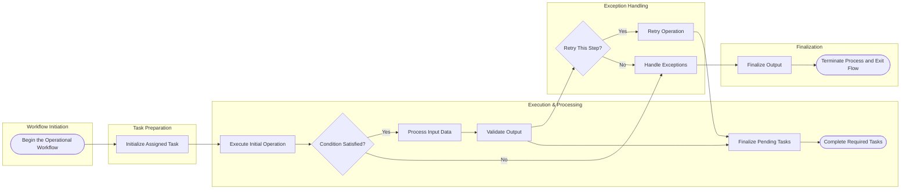

# Varagraph Design Specification

> Implementasi UI berdasarkan gambar referensi yang sudah dibuat di percakapan ini. Fokus utama: web app diagram editor seperti Excalidraw, mendukung import Mermaid, lalu node/diagram dapat di-drag-and-drop pada canvas. Diagram awal yang digunakan adalah **Vertical Pool Swimlane Flowchart** dengan warna pastel, rounded shapes, dan gaya modern/minimal.

---

## 1. Referensi Gambar Wajib

Gunakan gambar-gambar berikut sebagai referensi visual utama:

1. **Referensi App UI final / variasi utama**  
   File: `a_clean_modern_web_app_ui_screenshot_of_a_diagram.png`  
   Fungsi: referensi layout aplikasi, toolbar, sidebar, editor Mermaid, canvas swimlane, right style panel.

2. **Referensi App UI pastel sebelumnya**  
   File: `a_clean_modern_web_app_ui_screenshot_wide_deskto.png`  
   Fungsi: referensi warna pastel lane dan bentuk block smooth.

3. **Referensi Brand Asset Sheet**  
   File: `a_clean_flat_ui_brand_style_guide_asset_sheet_on.png`  
   Fungsi: referensi logo, ikon, color palette, UI components, diagram elements, lane styles, dan illustration style.

4. **Referensi Asset Sheet terpecah per item**  
   File: `a_clean_brand_style_guide_asset_sheet_ui_kit_c.png`  
   Fungsi: referensi crop asset satu per satu. Image ini menampilkan nama file ideal seperti `01 - LOGO.png`, `02 - LOGO VARIATIONS.png`, `03 - ICON SET (OUTLINE).png`, dst.

5. **Original diagram reference**  
   File: `image.png`  
   Fungsi: referensi struktur swimlane vertical pool flowchart awal, bukan style final. Style final harus mengikuti Varagraph pastel-modern.

> Catatan untuk Google AI Studio / Stitch: baca gambar referensi sebagai visual source of truth. Jangan membuat style generik. Semua spacing, rounded corner, pastel color, icon treatment, sidebar, toolbar, dan canvas harus mengikuti referensi Varagraph.

---

## 2. Product Concept

**Nama produk:** Varagraph  
**Tagline:** Visualize. Connect. Understand.  
**Kategori:** Web-based diagram editor  
**Core use case:** User meng-import kode Mermaid, sistem mengubahnya menjadi diagram visual yang bisa diedit secara drag-and-drop.

### Fitur MVP

- Mermaid import panel.
- Canvas diagram dengan dotted grid.
- Vertical swimlane / pool flowchart renderer.
- Drag-and-drop node pada canvas.
- Select node, move node, edit text, resize node.
- Toolbar drawing tools: select, pan, connector, text, decision, rectangle, circle, line.
- Right properties panel untuk style diagram.
- Export button untuk PNG/SVG/JSON.
- Auto layout button untuk merapikan diagram.
- Soft pastel theme.

---

## 3. Recommended Tech Stack

### Frontend

- **Vite** sebagai build tool.
- **React + TypeScript** untuk UI.
- **Tailwind CSS** untuk styling utama.
- **shadcn/ui** untuk komponen dasar: Button, Input, Tabs, Dropdown, Switch, Select, Card.
- **Lucide React** untuk icon system.
- **React Flow** untuk canvas graph, drag-and-drop node, edges, minimap, controls.
- **Mermaid** untuk parsing/render Mermaid awal.
- **Zustand** untuk state management diagram/editor.
- **Framer Motion** untuk micro-interaction ringan.

### Optional Libraries

- `@xyflow/react` / React Flow untuk node graph editor.
- `monaco-editor` atau `@uiw/react-codemirror` untuk Mermaid code editor.
- `html-to-image` untuk export PNG.
- `file-saver` untuk download asset/export.
- `nanoid` untuk ID node/edge.

### Suggested Project Setup

```bash
npm create vite@latest varagraph -- --template react-ts
cd varagraph
npm install
npm install tailwindcss @tailwindcss/vite lucide-react framer-motion zustand @xyflow/react mermaid nanoid html-to-image file-saver
npm install class-variance-authority clsx tailwind-merge
```

---

## 4. Visual Direction

Varagraph harus terasa seperti editor diagram modern, bersih, dan ringan. Hindari gaya corporate yang terlalu kaku. Gunakan banyak whitespace, border tipis, rounded corner, pastel lane header, icon outline, dan shadow sangat halus.

### Keywords

- Clean
- Pastel
- Soft UI
- Diagram-first
- Lightweight
- Modern rounded shapes
- Calm productivity
- Excalidraw-like editor, tetapi lebih polished dan SaaS-style

---

## 5. Layout Utama App

Ukuran referensi: desktop wide, sekitar 16:9.

### Struktur halaman

```txt
┌─────────────────────────────────────────────────────────────┐
│ Top Bar                                                     │
├──────────────┬────────────────────────────────┬─────────────┤
│ Left Sidebar │ Main Workspace                 │ Right Panel │
│              │ ┌ Mermaid Panel ┐ ┌ Canvas ┐  │             │
│              │ │ Code Import   │ │ Diagram│  │ Style Props │
│              │ └───────────────┘ └────────┘  │             │
├──────────────┴────────────────────────────────┴─────────────┤
│ Bottom file/tab bar                                          │
└─────────────────────────────────────────────────────────────┘
```

### Left Sidebar

Width: `240px` pada desktop.  
Background: `#FAFAFC` atau `#F8FAFC`.  
Border right: `1px solid #EEF0F4`.

Items:

- Logo Varagraph di atas.
- Section `WORKSPACE`:
  - Dashboard
  - Diagrams active
  - Templates
  - Trash
- Section `TOOLS`:
  - Import (Mermaid)
  - Export
  - Settings
- Bottom user card:
  - Avatar initial `A`
  - Name/email dummy
  - Plan badge kecil

Active item:

- Background: `#EEE9FF`
- Text: `#6B46F2`
- Border radius: `10px`

### Top Bar

Height: `72px`.  
Background: white.  
Border bottom: `1px solid #EEF0F4`.

Left:

- Page title: `Vertical Swimlane Diagram`
- Pencil/edit icon kecil

Center:

- Floating toolbar, positioned under top bar or centered at top of canvas.

Right:

- Undo
- Redo
- Cloud saved indicator
- Share button purple
- More menu

### Main Workspace

Background: `#FBFCFE`.  
Canvas area harus punya dotted grid halus.

Grid style:

```css
background-image: radial-gradient(#D8DEE9 0.8px, transparent 0.8px);
background-size: 16px 16px;
```

### Mermaid Import Panel

Position: kiri dari canvas, width sekitar `300px`.  
Background: white.  
Border: `1px solid #E7EAF0`.  
Radius: `12px`.  
Tabs: Mermaid / Examples.

Content:

- Label: `Paste Mermaid code below`
- Code editor dengan line number.
- Tombol `Import` primary purple.
- Tombol `Clear` secondary.

### Canvas Swimlane Area

Canvas card berada di tengah.

- Background: white translucent / `#FFFFFF`
- Border: `1px solid #E5E7EB`
- Radius: `14px`
- Shadow: very subtle, optional.
- Swimlane dibagi 5 vertical lanes.

Lane names:

1. Workflow Initiation
2. Task Preparation
3. Execution & Processing
4. Exception Handling
5. Finalization

Lane header height: `64px`.  
Lane body height: minimal `760px`.  
Lane vertical border: `1px solid #E8ECF3`.

### Right Style Panel

Width: `280px`.  
Background: white.  
Border: `1px solid #E7EAF0`.  
Radius: `12px`.

Tabs:

- Diagram active
- Style

Sections:

- Canvas
- Swimlanes
- Shapes
- Text

Controls:

- Background color input
- Grid switch
- Dot size select
- Header background palette swatches
- Header text color
- Lane border color
- Corner radius select
- Soft shadows switch
- Font family select
- Font size select
- Text color
- Reset style button

---

## 6. Brand Identity

### Logo

Logo Varagraph adalah mark berbentuk huruf `V` abstrak seperti kupu-kupu/dua ribbon yang bertemu di bawah. Warna utama gradient purple/lavender.

Logo text:

- Wordmark: `varagraph`
- Font style: rounded sans, bold, lowercase.
- Warna text: `#0F172A`.

### Logo Meaning

- Letter V = Varagraph.
- Dua sisi yang bertemu = connection & flow.
- Titik bawah = focus & clarity.

### Logo Usage

Sidebar logo:

- Icon size: `28px`.
- Wordmark size: `18px`, font weight `700`.

Splash/brand page logo:

- Icon size: `96px`.
- Wordmark size: `44px`.

---

## 7. Color Palette

Gunakan warna dari asset sheet sebagai basis.

### Primary

```css
--primary-500: #6366F1;
--primary-400: #8B5CF6;
--blue-500: #3882F6;
--blue-600: #1D4ED8;
```

### Secondary Pastel

```css
--pastel-mint: #A7F3D0;
--pastel-blue: #BDE0FE;
--pastel-peach: #FFD6A5;
--pastel-lavender: #E9D5FF;
--pastel-pink: #FBCFE8;
```

### Neutral

```css
--ink-900: #0F172A;
--ink-700: #334155;
--ink-500: #64748B;
--border: #CBD5E1;
--surface: #F8FAFC;
--white: #FFFFFF;
```

### Semantic

```css
--success: #22C55E;
--warning: #FACC15;
--orange: #FB923C;
--danger: #EF4444;
--info: #3882F6;
```

---

## 8. Typography

Default font: **Inter**.  
Fallback: `ui-sans-serif, system-ui, -apple-system, BlinkMacSystemFont, "Segoe UI", sans-serif`.

### Type Scale

- App title: `20px`, weight `600`, color `#0F172A`.
- Sidebar item: `14px`, weight `500`.
- Lane header: `13px`, weight `600`.
- Node text: `12px` atau `13px`, weight `500`.
- Panel label: `13px`, weight `500`, color `#334155`.
- Section heading: `13px`, weight `700`, color `#0F172A`.
- Code editor: `12px`, font family `JetBrains Mono` or `SFMono-Regular`.

---

## 9. Diagram Style

Diagram harus terlihat modern dan smooth, bukan seperti flowchart kaku klasik.

### Node Base

```css
.diagram-node {
  border-radius: 16px;
  border: 1px solid rgba(148, 163, 184, 0.28);
  background: #FFFFFF;
  color: #334155;
  box-shadow: 0 8px 24px rgba(15, 23, 42, 0.04);
  min-width: 128px;
  min-height: 56px;
  padding: 12px 16px;
}
```

### Start / End Node

- Shape: pill rounded rectangle.
- Radius: `999px`.
- Background: lavender / purple pastel.
- Example color: `#E9D5FF`.
- Border: `#D8B4FE`.

### Process Node

- Shape: rounded rectangle.
- Radius: `16px`.
- Background color tergantung lane:
  - Task: `#EEF4FF`
  - Execution: `#EAFBF7`
  - Exception: `#FFF1E8`
  - Finalization: `#EAF8EF`

### Decision Node

- Shape: diamond.
- Harus tetap smooth: diamond dengan slight border dan pastel fill.
- Background: `#E0F2FE` atau `#E7F8F5`.
- Border: `#BAE6FD`.

### Sub Process Node

- Rounded rectangle dengan dashed border.
- Border: `1.5px dashed #C4B5FD`.
- Background: `#FAF7FF`.

### Input / Output Node

- Parallelogram style, pastel peach fill.
- Background: `#FFF1E8`.
- Border: `#FDBA74`.

### Text Annotation

- Sticky note style.
- Background: `#FEF3C7`.
- Folded corner optional.

### Edges / Connectors

- Stroke: `#64748B`.
- Width: `1.5px`.
- Arrow marker triangular, small.
- Use elbow connectors for cross-lane routes.
- Labels: small `11px`, color `#334155`, background white with padding.

---

## 10. Swimlane Header Colors

Gunakan pastel berbeda per lane:

```css
.workflow-initiation { background: #F0E8FF; }
.task-preparation { background: #EAF2FF; }
.execution-processing { background: #E8F8F4; }
.exception-handling { background: #FFF0E6; }
.finalization { background: #F8E8F6; }
```

Header text color: `#1E293B`.

Lane body background: mostly white, boleh sangat subtle tint.

---

## 11. Initial Diagram Content

Render diagram awal seperti gambar referensi.

### Lanes

1. Workflow Initiation
2. Task Preparation
3. Execution & Processing
4. Exception Handling
5. Finalization

### Nodes

- `Begin the Operational Workflow` — start/end pill, lane 1.
- `Initialize Assigned Task` — process, lane 2.
- `Execute Initial Operation` — process, lane 3.
- `Condition Satisfied?` — decision, lane 3.
- `Process Input Data` — process, lane 3.
- `Validate Output` — process, lane 3.
- `Finalize Pending Tasks` — process, lane 3.
- `Complete Required Tasks` — start/end pill, lane 3.
- `Handle Exceptions` — process, lane 4.
- `Retry This Step?` — decision, lane 4.
- `Retry Operation` — process, lane 4.
- `Finalize Output` — process, lane 5.
- `Terminate Process and Exit Flow` — start/end pill, lane 5.

### Edges

- Begin → Initialize
- Initialize → Execute
- Execute → Condition
- Condition YES → Process Input Data
- Condition NO → Handle Exceptions
- Process Input Data → Validate Output
- Validate Output → Retry This Step?
- Retry This Step YES → Retry Operation
- Retry Operation → Finalize Pending Tasks
- Retry This Step NO → Handle Exceptions
- Handle Exceptions → Finalize Output
- Finalize Output → Terminate
- Validate Output → Finalize Pending Tasks
- Finalize Pending Tasks → Complete Required Tasks

---

## 12. Mermaid Example for Import Panel

Isi default editor Mermaid:



---

## 13. Asset Extraction / Cropping Prompt

Gunakan prompt ini di Google AI Studio / Stitch untuk mengambil asset dari image sheet dan membuat ulang SVG-nya.

### Prompt untuk Crop Asset PNG

```txt
You are given the image file `a_clean_brand_style_guide_asset_sheet_ui_kit_c.png`. It contains a grid of Varagraph brand assets, each shown inside a white card with a filename label below or inside the card.

Please crop each card into a separate transparent PNG file. Preserve the asset exactly as shown, centered with padding. Remove the surrounding page background and card border when possible, but keep internal layout when the asset is a grouped asset sheet.

Export these files:

01-logo.png
02-logo-variations.png
03-icon-set-outline.png
04-icon-set-filled-soft.png
05-color-palette.png
06-swimlane-diagram-elements.png
07-diagram-lane-styles.png
08-brand-mark-meaning.png
09-ui-components.png
10-illustrations.png

Also crop individual icons from the icon set into separate 24x24 SVG-friendly PNG references:

icon-select.png
icon-pan.png
icon-rectangle.png
icon-decision.png
icon-circle.png
icon-text.png
icon-image.png
icon-comment.png
icon-link.png
icon-table.png
icon-layer.png
icon-undo.png
icon-redo.png
icon-cloud.png
icon-upload.png
icon-download.png
icon-settings.png
icon-trash.png
icon-duplicate.png
icon-lock.png
icon-eye.png
icon-more.png
icon-plus.png
icon-minus.png
icon-zoom.png
icon-fullscreen.png
icon-align-left.png
icon-align-center.png
icon-align-right.png
```

### Prompt untuk Recreate SVG Assets

```txt
Use `a_clean_flat_ui_brand_style_guide_asset_sheet_on.png` and `a_clean_brand_style_guide_asset_sheet_ui_kit_c.png` as visual references.

Recreate the Varagraph logo and icons as clean SVG files. Do not trace raster artifacts. Rebuild them as crisp vector shapes.

Requirements:
- Use simple geometric paths.
- Preserve the Varagraph logo concept: abstract V/butterfly/ribbon mark with two purple gradient wings and a small lavender circle at the bottom center.
- Export logo mark as `varagraph-mark.svg`.
- Export horizontal logo as `varagraph-logo-horizontal.svg`.
- Export monochrome white mark as `varagraph-mark-white.svg`.
- Export monochrome dark mark as `varagraph-mark-dark.svg`.
- Icons should use 24x24 viewBox, stroke width 1.75, rounded caps and joins.
- Outline icons should use `currentColor` strokes and no fill.
- Soft filled icons should use a pastel rounded square background and a dark outline icon.
- Use accessible, semantic file names.

Generate SVGs for:
select, pan, rectangle, decision, circle, text, image, comment, link, table, layer, undo, redo, cloud, upload, download, settings, trash, duplicate, lock, eye, more, plus, minus, zoom, fullscreen, align-left, align-center, align-right.
```

### Prompt untuk Generate Asset Folder Structure

```txt
Create an asset folder for a Vite + React + Tailwind app named Varagraph.

Folder structure:

src/assets/brand/varagraph-mark.svg
src/assets/brand/varagraph-logo-horizontal.svg
src/assets/brand/varagraph-mark-white.svg
src/assets/brand/varagraph-mark-dark.svg
src/assets/icons/*.svg
src/assets/illustrations/import-mermaid.svg
src/assets/illustrations/drag-drop.svg
src/assets/illustrations/auto-layout.svg
src/assets/illustrations/collaborate.svg
src/assets/illustrations/export.svg
src/assets/illustrations/cloud-sync.svg
src/assets/tokens/colors.ts
src/assets/tokens/diagram.ts

Make all SVGs optimized, editable, and consistent with the Varagraph style guide.
```

---

## 14. SVG Logo Direction

Contoh SVG logo mark awal. Boleh di-improve agar lebih mirip referensi.

```svg
<svg width="64" height="64" viewBox="0 0 64 64" fill="none" xmlns="http://www.w3.org/2000/svg">
  <path d="M14 10C20 8 25 13 28 21L33 36C34 40 30 45 25 43C20 41 17 34 14 27L10 18C8 14 10 11 14 10Z" fill="url(#leftWing)"/>
  <path d="M50 10C44 8 39 13 36 21L31 36C30 40 34 45 39 43C44 41 47 34 50 27L54 18C56 14 54 11 50 10Z" fill="url(#rightWing)"/>
  <circle cx="32" cy="43" r="8" fill="#A78BFA" fill-opacity="0.8"/>
  <defs>
    <linearGradient id="leftWing" x1="10" y1="10" x2="34" y2="46" gradientUnits="userSpaceOnUse">
      <stop stop-color="#A78BFA"/>
      <stop offset="1" stop-color="#5B4BFF"/>
    </linearGradient>
    <linearGradient id="rightWing" x1="54" y1="10" x2="30" y2="46" gradientUnits="userSpaceOnUse">
      <stop stop-color="#8B5CF6"/>
      <stop offset="1" stop-color="#6366F1"/>
    </linearGradient>
  </defs>
</svg>
```

---

## 15. Tailwind Theme Tokens

Tambahkan token berikut ke konfigurasi Tailwind atau CSS variables.

```css
:root {
  --background: #FBFCFE;
  --foreground: #0F172A;
  --card: #FFFFFF;
  --card-foreground: #0F172A;
  --border: #E5E7EB;
  --muted: #F8FAFC;
  --muted-foreground: #64748B;
  --primary: #6B46F2;
  --primary-hover: #5B35E8;
  --primary-foreground: #FFFFFF;
  --accent: #EEE9FF;
  --accent-foreground: #6B46F2;
  --ring: #8B5CF6;

  --lane-purple: #F0E8FF;
  --lane-blue: #EAF2FF;
  --lane-mint: #E8F8F4;
  --lane-peach: #FFF0E6;
  --lane-pink: #F8E8F6;

  --node-purple: #E9D5FF;
  --node-blue: #DBEAFE;
  --node-mint: #DCFCE7;
  --node-peach: #FFEDD5;
  --node-pink: #FCE7F3;
}
```

---

## 16. Component Architecture

Suggested files:

```txt
src/
  app/
    App.tsx
  components/
    layout/
      AppShell.tsx
      Sidebar.tsx
      TopBar.tsx
      BottomTabs.tsx
    editor/
      DiagramWorkspace.tsx
      MermaidPanel.tsx
      CanvasToolbar.tsx
      StylePanel.tsx
      SwimlaneCanvas.tsx
      SwimlaneHeader.tsx
      DiagramNode.tsx
      DiagramEdge.tsx
    icons/
      VaragraphLogo.tsx
  lib/
    mermaid/
      parseMermaidToGraph.ts
    diagram/
      autoLayout.ts
      swimlaneLayout.ts
    store/
      useDiagramStore.ts
  styles/
    globals.css
```

---

## 17. Interaction Requirements

### Import Mermaid Flow

1. User paste Mermaid code.
2. User klik `Import`.
3. Parser membaca subgraph sebagai lanes.
4. Nodes ditempatkan sesuai lane.
5. Edges dibuat berdasarkan hubungan Mermaid.
6. Canvas auto fit view.

### Drag-and-Drop

- Node bisa dipindahkan bebas dalam lane.
- Saat node dipindahkan melewati lane lain, lane assignment berubah.
- Edge tetap mengikuti node.
- Jika user klik Auto Layout, node dikembalikan ke layout rapi.

### Selection

- Klik node untuk select.
- Selected state:
  - Border: `#8B5CF6`
  - Shadow: `0 0 0 4px rgba(139, 92, 246, 0.12)`
- Right panel berubah menampilkan style node jika node terseleksi.

### Canvas Controls

- Zoom in/out.
- Fit to screen.
- Pan mode.
- Grid toggle.

---

## 18. Implementation Prompt for Google AI Studio / Stitch

Gunakan prompt berikut untuk menghasilkan kode implementasi awal.

```txt
Build a Vite + React + TypeScript + Tailwind CSS web app named Varagraph based on the attached reference images:

- a_clean_modern_web_app_ui_screenshot_of_a_diagram.png
- a_clean_modern_web_app_ui_screenshot_wide_deskto.png
- a_clean_flat_ui_brand_style_guide_asset_sheet_on.png
- a_clean_brand_style_guide_asset_sheet_ui_kit_c.png
- image.png

The app is a diagram editor similar to Excalidraw, but focused on Mermaid import and editable vertical swimlane diagrams.

Use the generated design.md as the source of truth. Implement the UI as a polished desktop app with:

1. Left sidebar with Varagraph logo, workspace navigation, tools, and user card.
2. Top bar with diagram title, edit icon, undo/redo, saved status, share button, and more menu.
3. Center floating toolbar with select, pan, connector, text, decision, rectangle, circle, line, and more tools.
4. Mermaid import panel with tabs, code editor-like textarea with default Mermaid flowchart, Import and Clear buttons.
5. Main canvas with dotted grid background and a vertical swimlane flowchart.
6. Swimlane card with five lanes: Workflow Initiation, Task Preparation, Execution & Processing, Exception Handling, Finalization.
7. Pastel lane headers and modern rounded nodes, matching the Varagraph reference images.
8. Right style panel with Diagram/Style tabs and controls for canvas, swimlanes, shapes, and text.
9. Bottom tab bar showing the current diagram tab.

Use React Flow for nodes and edges if possible. If React Flow is unavailable, implement absolute-positioned nodes and SVG edges manually.

Important visual details:
- Use Inter font.
- Use Tailwind CSS.
- Use pastel colors, soft shadows, thin borders, rounded corners.
- Use Lucide React icons.
- The diagram nodes must be draggable.
- The diagram should look like the reference images, not a generic flowchart.
- Use the Varagraph logo mark from the asset reference. If no SVG asset exists yet, recreate it as an inline SVG component.

Output production-quality code with clean component structure.
```

---

## 19. Implementation Notes for React Flow

Use node types:

- `startEndNode`
- `processNode`
- `decisionNode`
- `subProcessNode`
- `inputOutputNode`
- `annotationNode`

Use lane metadata:

```ts
export type LaneId =
  | 'workflow-initiation'
  | 'task-preparation'
  | 'execution-processing'
  | 'exception-handling'
  | 'finalization';

export interface Swimlane {
  id: LaneId;
  title: string;
  color: string;
  x: number;
  width: number;
}
```

Node data:

```ts
export interface DiagramNodeData {
  label: string;
  laneId: LaneId;
  variant: 'startEnd' | 'process' | 'decision' | 'subProcess' | 'inputOutput' | 'annotation';
  icon?: string;
}
```

---

## 20. Quality Checklist

Sebelum dianggap selesai, pastikan:

- Brand name sudah **Varagraph**, bukan Swimlane Studio.
- Logo Varagraph tampil di sidebar.
- Diagram menggunakan warna pastel soft.
- Shapes smooth dan modern.
- Import Mermaid panel terlihat seperti code editor.
- Swimlane header memiliki warna berbeda.
- Canvas punya dotted grid.
- Semua panel punya border tipis dan radius besar.
- Node bisa di-drag-and-drop.
- UI desktop terlihat seimbang dan tidak terlalu padat.
- Tidak menggunakan warna magenta keras dari referensi awal; gunakan pastel.
- Export/crop asset prompts tersedia.
- SVG recreation prompt tersedia.

---

## 21. Deliverables yang Diharapkan

Untuk tahap pertama:

1. `design.md`
2. React/Vite app skeleton
3. `src/assets/brand/varagraph-mark.svg`
4. `src/assets/icons/*.svg`
5. `src/components/editor/SwimlaneCanvas.tsx`
6. `src/components/editor/MermaidPanel.tsx`
7. `src/components/editor/StylePanel.tsx`
8. `src/lib/mermaid/parseMermaidToGraph.ts`
9. `src/lib/diagram/swimlaneLayout.ts`
