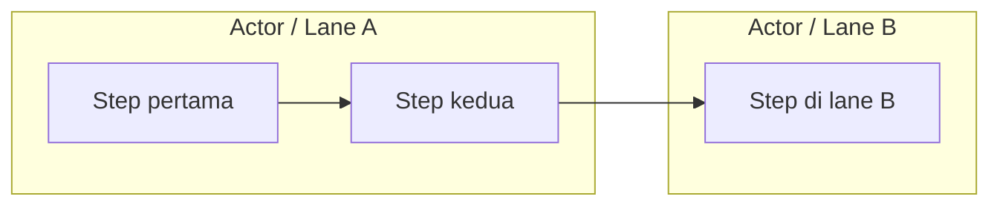

# Guide Membuat Swimlane yang Readable di Varagraph

Tujuan utama: diagram gampang dipahami sekilas, alur utama jelas, crossing sedikit, bend sedikit, dan tiap lane tetap punya peran jelas.

## 1. Struktur dasar Mermaid

Pakai format ini:



Rule:
- Pakai `flowchart LR`.
- Tiap lane pakai `subgraph`.
- Deklarasikan semua node dulu di dalam lane, baru edge di bawah.
- Urutan node dalam lane harus dari proses paling awal ke paling akhir.
- Jangan bikin lane untuk status kecil; status biasanya node, bukan lane.

## 2. Lane harus punya peran jelas

Lane = aktor, sistem, service, atau boundary tanggung jawab.

Contoh bagus:
- `User`
- `Frontend`
- `Auth Service`
- `Booking Service`
- `Payment Gateway`

Hindari lane seperti:
- `Success`
- `Failed`
- `Waiting`
- `Done`

Status seperti itu lebih cocok jadi node atau label branch.

## 3. Alur utama top-to-bottom

Dalam lane yang sama, flow normal harus turun vertikal.

Bagus:

```mermaid
A1[Open Page] --> A2[Check Session]
A2 --> A3[Request Ticket]
A3 --> A4[Store Ticket]
```

Hindari:
- alur naik-turun panjang,
- edge balik jauh ke atas,
- node yang muncul sebelum proses pendahulunya.

Kalau satu lane terasa terlalu panjang, bukan berarti harus dipaksa cross-lane. Cek dulu apakah prosesnya bisa disederhanakan.

## 4. Cross-lane handoff harus side-to-side kalau direct

Kalau proses berpindah antar lane dan levelnya sama, buat target berada di row/logical level yang sama supaya edge bisa horizontal.

Bagus:
- `Click Consume MFE -> Mount Component`
- kalau side corridor kosong, harus side-to-side.
- kalau side corridor ketutup node lain, top/bottom target boleh jadi fallback.

Mental model:
- Same-lane = vertical.
- Cross-lane = horizontal.
- Top/bottom cross-lane = fallback kalau side route padat/terblokir.

## 5. Decision node khusus untuk branching

Normal block maksimal 1 outgoing edge.

Salah:

```mermaid
A1[Validate Cookie] --> A2[Render Booking]
A1 --> A3[Show Unauthorized]
```

Benar:

```mermaid
A1[Validate Cookie] --> A2{Cookie Valid?}
A2 -- Yes --> A3[Render Booking]
A2 -- No --> A4[Show Unauthorized]
```

Rule:
- Process block: max 1 outgoing.
- Decision: max 2 outgoing.
- Kalau butuh 3+ cabang, pecah jadi beberapa decision.
- Label cabang harus pendek: `Yes`, `No`, `Valid`, `Invalid`, `Retry`, `End`.

## 6. Decision cross-lane sebaiknya horizontal

Kalau decision output masuk lane lain, usahakan target berada sejajar dengan decision.

Bagus:

```mermaid
A3{Session Found?}
A3 -- Yes --> C1[Mount Component]
A3 -- No --> A4[Request SSO Ticket]
```

Target cross-lane `Yes` sebaiknya di row yang sama, bukan jauh di bawah.

Hindari decision cabang yang turun terlalu jauh lalu crossing banyak node.

## 7. Terminal / sink target punya aturan khusus

Terminal target = node akhir yang menerima beberapa incoming, misalnya `Show Result`.

Rule:
- Source utama yang paling sejajar masuk dari side anchor.
- Source sekunder yang berebut side anchor boleh masuk dari top.
- Ini mengurangi garis numpuk di titik yang sama.

Contoh:
- `Render Booking -> Show Result` = primary route, side-to-side.
- `Show Unauthorized -> Show Result` = secondary route, boleh masuk top.
- Jangan paksa semua incoming masuk side yang sama.

## 8. Top anchor bukan error

Top target valid untuk:
- secondary incoming ke terminal target,
- lateral route yang side corridor-nya ketutup node,
- route yang kalau dipaksa side akan crossing atau bend berlebihan.

Top target tidak cocok untuk:
- clean direct cross-lane route,
- primary terminal route,
- same-level handoff yang side corridor kosong.

## 9. Retry/cycle harus pendek

Retry loop boleh, tapi harus kecil dan jelas.

Bagus:

```mermaid
A1[Submit Form] --> A2{Valid?}
A2 -- No --> A1
A2 -- Yes --> B1[Process Data]
```

Hindari:
- cycle besar muter banyak lane,
- edge balik jauh dari bawah ke atas,
- retry tanpa label.

Kalau retry kompleks, pecah jadi subflow atau decision tambahan.

## 10. Label node singkat

Label ideal:
- 2–4 kata.
- Maksimal 5–7 kata kalau perlu.
- Verb + object.

Bagus:
- `Check Session`
- `Validate Cookie`
- `Request Ticket`
- `Mount Component`
- `Render Booking`
- `Show Result`

Kurang bagus:
- `Do checking whether current browser already has existing user session cookie or not`

## 11. Hindari crossing sejak authoring

Sebelum auto-layout, cek struktur flow:

Pertanyaan:
- Apakah target cabang bisa disejajarkan dengan source?
- Apakah node yang menghalangi side route bisa dipindah row?
- Apakah branch ini perlu decision?
- Apakah terminal target menerima terlalu banyak edge dari arah sama?
- Apakah ada cycle besar yang bisa dipotong?

Kalau crossing banyak, biasanya masalah bukan routing, tapi struktur diagram terlalu padat.

## 12. Checklist sebelum diagram dianggap bagus

- [ ] Tiap lane punya aktor/tanggung jawab jelas.
- [ ] Node dalam lane diurut dari awal ke akhir.
- [ ] Main flow bisa dibaca top-to-bottom.
- [ ] Cross-lane handoff direct dibuat side-to-side.
- [ ] Decision dipakai untuk semua branching.
- [ ] Normal block tidak punya lebih dari 1 outgoing.
- [ ] Decision tidak punya lebih dari 2 outgoing.
- [ ] Branch decision punya label pendek.
- [ ] Terminal target punya primary route jelas.
- [ ] Secondary terminal route boleh masuk top kalau side anchor ramai.
- [ ] Retry loop pendek dan jelas.
- [ ] Tidak ada crossing yang bisa dihindari.
- [ ] Bend tidak berlebihan.
- [ ] Label node pendek dan konsisten.

## 13. Rule cepat

Kalau bingung:

1. **Satu lane = satu actor/service.**
2. **Satu node = satu aksi.**
3. **Same-lane = turun.**
4. **Cross-lane = samping.**
5. **Branch = decision.**
6. **Process block max 1 outgoing.**
7. **Decision max 2 outgoing.**
8. **Primary terminal = side.**
9. **Secondary terminal = top kalau side ramai.**
10. **Minim crossing lebih penting daripada memodelkan semua detail.**
